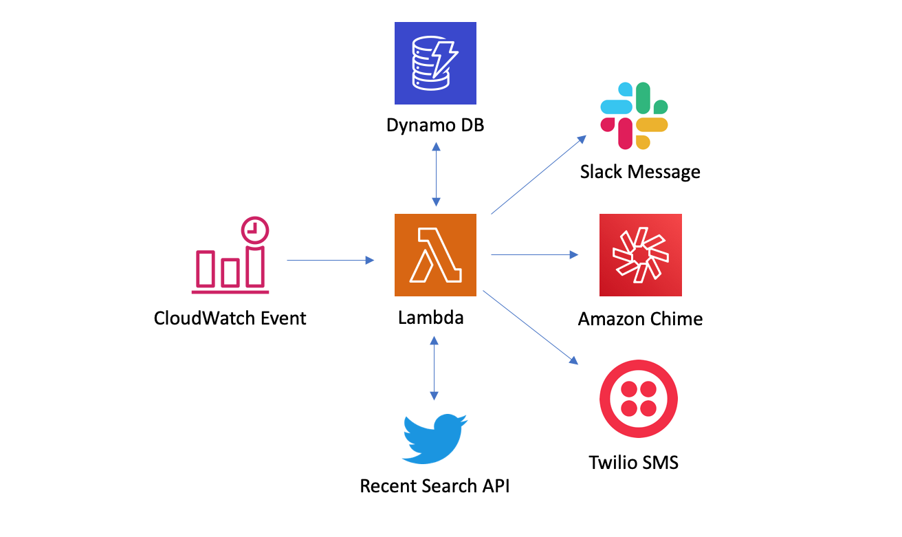

# Building a serverless app for publishing Tweets of interest to your favorite communication channels

A sample serverless app that periodically gets Tweets of interest using the Twitter Recent Search APIs and publishes those tweets to Slack, Amazon Chime and sends SMS using Twilio

# Demo Features

This app demonstrates:

- Use of Twitter Recent Search APIs
- AWS Lambda, DynamoDB, Secrets Manager
- Publishing messages to Slack & Amazon Chime
- Sending SMS using Twilio using Java SDK

# Architecture

# Setting up a Twitter App
In order to use the Twitter APIs in this app, you will need the following:

* A Twitter developer account. Click [here](https://developer.twitter.com/en/apply-for-access) to apply.
* A Twitter [app](https://developer.twitter.com/en/apps)
* Your Twitter API keys. Please review the documentation about obtaining your keys [here](https://developer.twitter.com/en/docs/basics/apps/overview).
* Enroll the app in [Twitter Developer Labs](https://developer.twitter.com/en/labs).

# Capturing Tweets of interest
In your Lambda function, make sure to add the SEARCH_STRING as an environment variable with your own search string value to capture the Tweets of interest to you. You can search by Tweets from a particular account, Tweets that include images, media etc. and also filter on excluding certain Tweets or conditions. More information on building queries for recent search can be found on our [documentation page](https://developer.twitter.com/en/docs/labs/recent-search/guides/search-queries).

In this project, currently SEARCH_STRING is set to

"(from:@CNN OR from:@BBCWorld) lang:en \\"breaking news\\" -is:retweet"

which means we are looking for all tweets from the CNN or BBCWorld account that are not a retweet, in the english language and contain the words Breaking News.

# Setting up the Slack webhook

In order to send Tweets of interest to a slack channel, you will need to create as shown [here](https://api.slack.com/messaging/webhooks). You will need the webhook url and a name for your bot that will publish Tweets of interest to channels.

# Setting up the Chime webhook

In order to send Tweets of interest to a chime channel, you will need to add a webhook to your chat room as shown [here](https://docs.aws.amazon.com/chime/latest/dg/webhooks.html). You will need the webhook url that will publish Tweets of interest to the channel.

# Setting up Twilio to receive SMS

In order to send SMS using Twilio, you will need to create and account and set up an app. Please refer to the Twilio [documentation](https://www.twilio.com/docs/sms/quickstart/java) on getting started in Java. You will need the sid, token and the phone numbers to which you want to send and receive messages from.

# AWS Configurations

## Storing keys in AWS Secrets Manager
Instead of storing API Keys, Secrets, Webhooks etc in properties files, we will store these in AWS Secrets Manager and use them in our code programmatically. More information on adding secrets to Secrets Manager can be found [here](https://docs.aws.amazon.com/secretsmanager/latest/userguide/tutorials_basic.html). You will need to add the following key value pair:
* twitter-api-key
* twitter-api-secret
* slack-webhook-url
* chime-webhook-url
* dynamo-table-name
* dynamo-table-pk
* twilio-sid
* twilio-token
* twilio-from-number
* twilio-to-number

## Storing data in DynamoDB
In this tutorial, we will storing the tweet ids of the published Tweets. In order to that, you will have to create a table in Dynamo with a primary key (String) to store the Tweet ids. More information on creating tables in DynamoDB can be found [here](https://docs.aws.amazon.com/amazondynamodb/latest/developerguide/SampleData.CreateTables.html).

## Creating a CloudWatch Trigger
In order to invoke the lambda function periodically, we will need to create a CloudWatch Trigger rule that will invoke the lambda function (every hour in this example). Information on creating a CloudWatch rule can be found [here](https://docs.aws.amazon.com/AmazonCloudWatch/latest/events/RunLambdaSchedule.html). Make sure to set the trigger interval to 1 hour.

## Deploying the app to AWS Lambda
1. Go to the [AWS Console](http://console.aws.amazon.com/) and create a Lambda function.
2. Select author from scratch and give your function a name (e.g. twitter-notifier) and select Java 8 as the runtime.
3. Select appropriate role and click create function.
4. Build a jar file to upload it into the lambda function:
    - Make sure to add the SEARCH_STRING as an environment variable with your own search string value to capture the Tweets of interest to you.
    - Make sure to add the REGION string as an environment variable with the value for your AWS region if you are using a region other than us-east-1.
    - Make sure to add the BOT_NAME string as an environment variable with a name for your slack bot
    - Make sure to add the SECRET_NAME string as an environment variable with the value of your secret that holds your different keys
    - Using maven: go to the directory containing pom.xml, and run 'mvn assembly:assembly -DdescriptorId=jar-with-dependencies package'. This will generate a zip file named "tweet-buddy-1.0-jar-with-dependencies.jar" in the target directory.
5. For Code entry type, select "Upload a .ZIP file" and then upload the jar file created in the previous step from the build directory to Lambda.
6. Set the Handler as LambdaHandler
7. Increase the Timeout to 30 seconds and make sure memory is set to at least 512 MB under Basic Settings.
8. Click add trigger, and select Cloudwatch Events/EventBridge. Under rules, click on the rule you created above and click add.
9. Click save to complete setting up the lambda function.
